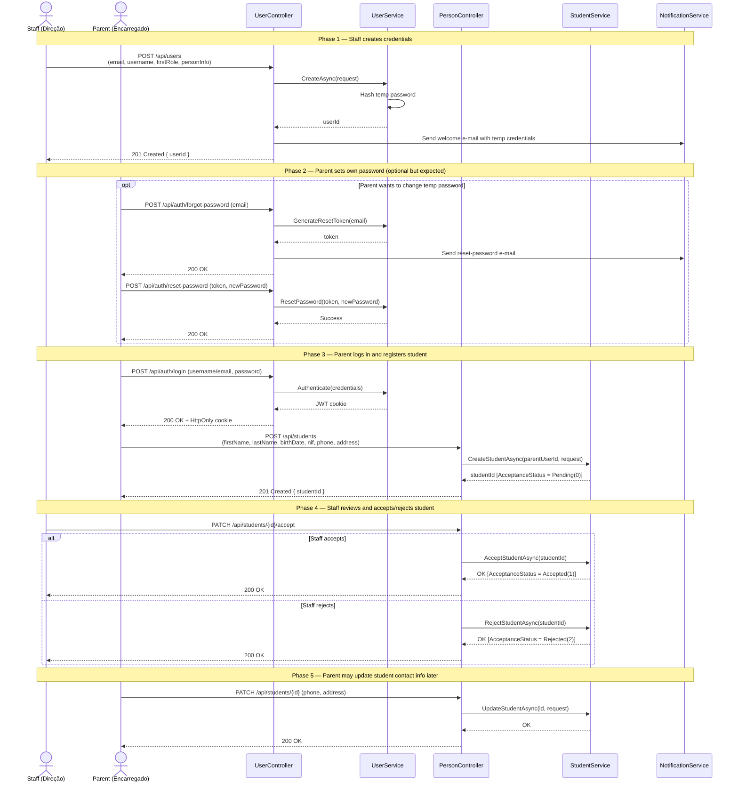
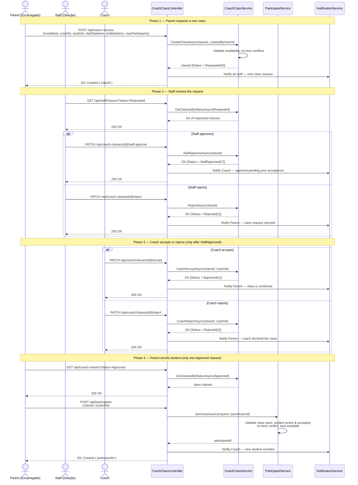
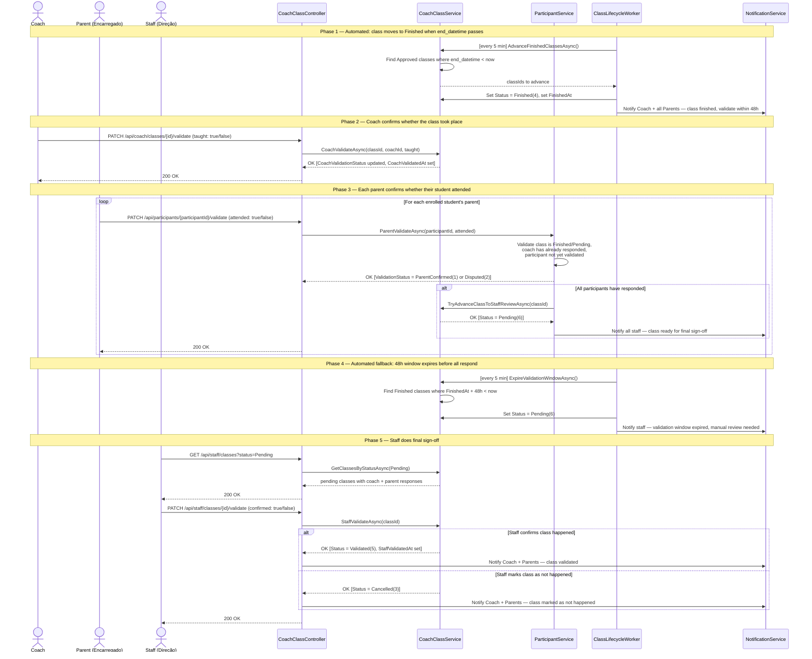

# Sequence Diagram — Create New User

```mermaid
sequenceDiagram
    actor Staff as Staff (Direção)
    actor Parent as Parent (Encarregado)
    participant UC as UserController
    participant US as UserService
    participant SC as PersonController
    participant SS as StudentService
    participant NS as NotificationService

    Note over Staff,NS: Phase 1 — Staff creates credentials

    Staff->>UC: POST /api/users<br/>(email, username, firstRole, personInfo)
    UC->>US: CreateAsync(request)
    US->>US: Hash temp password
    US-->>UC: userId
    UC->>NS: Send welcome e-mail with temp credentials
    UC-->>Staff: 201 Created { userId }

    Note over Staff,NS: Phase 2 — Parent sets own password (optional but expected)

    opt Parent wants to change temp password
        Parent->>UC: POST /api/auth/forgot-password (email)
        UC->>US: GenerateResetToken(email)
        US-->>UC: token
        UC->>NS: Send reset-password e-mail
        UC-->>Parent: 200 OK

        Parent->>UC: POST /api/auth/reset-password (token, newPassword)
        UC->>US: ResetPassword(token, newPassword)
        US-->>UC: Success
        UC-->>Parent: 200 OK
    end

    Note over Staff,NS: Phase 3 — Parent logs in and registers student

    Parent->>UC: POST /api/auth/login (username/email, password)
    UC->>US: Authenticate(credentials)
    US-->>UC: JWT cookie
    UC-->>Parent: 200 OK + HttpOnly cookie

    Parent->>SC: POST /api/students<br/>(firstName, lastName, birthDate, nif, phone, address)
    SC->>SS: CreateStudentAsync(parentUserId, request)
    SS-->>SC: studentId  [AcceptanceStatus = Pending(0)]
    SC-->>Parent: 201 Created { studentId }

    Note over Staff,NS: Phase 4 — Staff reviews and accepts/rejects student

    Staff->>SC: PATCH /api/students/{id}/accept
    alt Staff accepts
        SC->>SS: AcceptStudentAsync(studentId)
        SS-->>SC: OK  [AcceptanceStatus = Accepted(1)]
        SC-->>Staff: 200 OK
    else Staff rejects
        SC->>SS: RejectStudentAsync(studentId)
        SS-->>SC: OK  [AcceptanceStatus = Rejected(2)]
        SC-->>Staff: 200 OK
    end

    Note over Staff,NS: Phase 5 — Parent may update student contact info later

    Parent->>SC: PATCH /api/students/{id} (phone, address)
    SC->>SS: UpdateStudentAsync(id, request)
    SS-->>SC: OK
    SC-->>Parent: 200 OK
```

---

# Sequence Diagram — Create and Enroll in a Class

```mermaid
sequenceDiagram
    actor Parent as Parent (Encarregado)
    actor Staff as Staff (Direção)
    actor Coach
    participant CC as CoachClassController
    participant CS as CoachClassService
    participant PS as ParticipantService
    participant NS as NotificationService

    Note over Parent,NS: Phase 1 — Parent requests a new class

    Parent->>CC: POST /api/coach-classes<br/>(modalityId, coachId, studioId, startDatetime, endDatetime, maxParticipants)
    CC->>CS: CreateClassAsync(request, createdByUserId)
    CS->>CS: Validate availability, no time conflicts
    CS-->>CC: classId  [Status = Requested(0)]
    CC->>NS: Notify all staff — new class request
    CC-->>Parent: 201 Created { classId }

    Note over Parent,NS: Phase 2 — Staff reviews the request

    Staff->>CC: GET /api/staff/classes?status=Requested
    CC->>CS: GetClassesByStatusAsync(Requested)
    CS-->>CC: list of requested classes
    CC-->>Staff: 200 OK

    alt Staff approves
        Staff->>CC: PATCH /api/coach-classes/{id}/staff-approve
        CC->>CS: StaffApproveAsync(classId)
        CS-->>CC: OK  [Status = StaffApproved(7)]
        CC->>NS: Notify Coach — approval pending your acceptance
        CC-->>Staff: 200 OK
    else Staff rejects
        Staff->>CC: PATCH /api/coach-classes/{id}/reject
        CC->>CS: RejectAsync(classId)
        CS-->>CC: OK  [Status = Rejected(2)]
        CC->>NS: Notify Parent — class request rejected
        CC-->>Staff: 200 OK
    end

    Note over Parent,NS: Phase 3 — Coach accepts or rejects (only after StaffApproved)

    alt Coach accepts
        Coach->>CC: PATCH /api/coach/classes/{id}/accept
        CC->>CS: CoachAcceptAsync(classId, coachId)
        CS-->>CC: OK  [Status = Approved(1)]
        CC->>NS: Notify Parent — class is confirmed
        CC-->>Coach: 200 OK
    else Coach rejects
        Coach->>CC: PATCH /api/coach/classes/{id}/reject
        CC->>CS: CoachRejectAsync(classId, coachId)
        CS-->>CC: OK  [Status = Rejected(2)]
        CC->>NS: Notify Parent — coach declined the class
        CC-->>Coach: 200 OK
    end

    Note over Parent,NS: Phase 4 — Parent enrolls student (only into Approved classes)

    Parent->>CC: GET /api/coach-classes?status=Approved
    CC->>CS: GetClassesByStatusAsync(Approved)
    CS-->>CC: open classes
    CC-->>Parent: 200 OK

    Parent->>CC: POST /api/participants<br/>(classId, studentId)
    CC->>PS: JoinClassAsync(request, parentUserId)
    PS->>PS: Validate class open, student active & accepted,<br/>no time conflict, seat available
    PS-->>CC: participantId
    CC->>NS: Notify Coach — new student enrolled
    CC-->>Parent: 201 Created { participantId }
```

---

# Sequence Diagram — Validate Class (48h Window)

```mermaid
sequenceDiagram
    actor Coach
    actor Parent as Parent (Encarregado)
    actor Staff as Staff (Direção)
    participant CC as CoachClassController
    participant CS as CoachClassService
    participant PS as ParticipantService
    participant CLW as ClassLifecycleWorker
    participant NS as NotificationService

    Note over Coach,NS: Phase 1 — Automated: class moves to Finished when end_datetime passes

    CLW->>CS: [every 5 min] AdvanceFinishedClassesAsync()
    CS->>CS: Find Approved classes where end_datetime < now
    CS-->>CLW: classIds to advance
    CLW->>CS: Set Status = Finished(4), set FinishedAt
    CLW->>NS: Notify Coach + all Parents — class finished, validate within 48h

    Note over Coach,NS: Phase 2 — Coach confirms whether the class took place

    Coach->>CC: PATCH /api/coach/classes/{id}/validate (taught: true/false)
    CC->>CS: CoachValidateAsync(classId, coachId, taught)
    CS-->>CC: OK  [CoachValidationStatus updated, CoachValidatedAt set]
    CC-->>Coach: 200 OK

    Note over Coach,NS: Phase 3 — Each parent confirms whether their student attended

    loop For each enrolled student's parent
        Parent->>CC: PATCH /api/participants/{participantId}/validate (attended: true/false)
        CC->>PS: ParentValidateAsync(participantId, attended)
        PS->>PS: Validate class is Finished/Pending,<br/>coach has already responded,<br/>participant not yet validated
        PS-->>CC: OK  [ValidationStatus = ParentConfirmed(1) or Disputed(2)]

        alt All participants have responded
            PS->>CS: TryAdvanceClassToStaffReviewAsync(classId)
            CS-->>PS: OK  [Status = Pending(6)]
            PS->>NS: Notify all staff — class ready for final sign-off
        end

        CC-->>Parent: 200 OK
    end

    Note over Coach,NS: Phase 4 — Automated fallback: 48h window expires before all respond

    CLW->>CS: [every 5 min] ExpireValidationWindowAsync()
    CS->>CS: Find Finished classes where FinishedAt + 48h < now
    CLW->>CS: Set Status = Pending(6)
    CLW->>NS: Notify staff — validation window expired, manual review needed

    Note over Coach,NS: Phase 5 — Staff does final sign-off

    Staff->>CC: GET /api/staff/classes?status=Pending
    CC->>CS: GetClassesByStatusAsync(Pending)
    CS-->>CC: pending classes with coach + parent responses
    CC-->>Staff: 200 OK

    Staff->>CC: PATCH /api/staff/classes/{id}/validate (confirmed: true/false)
    CC->>CS: StaffValidateAsync(classId)
    alt Staff confirms class happened
        CS-->>CC: OK  [Status = Validated(5), StaffValidatedAt set]
        CC->>NS: Notify Coach + Parents — class validated
    else Staff marks class as not happened
        CS-->>CC: OK  [Status = Cancelled(3)]
        CC->>NS: Notify Coach + Parents — class marked as not happened
    end
    CC-->>Staff: 200 OK
```
